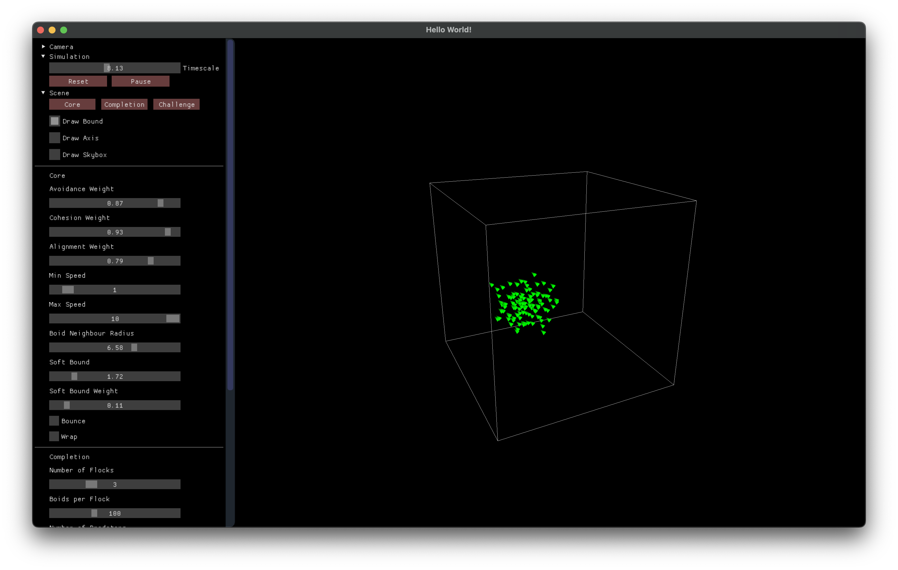
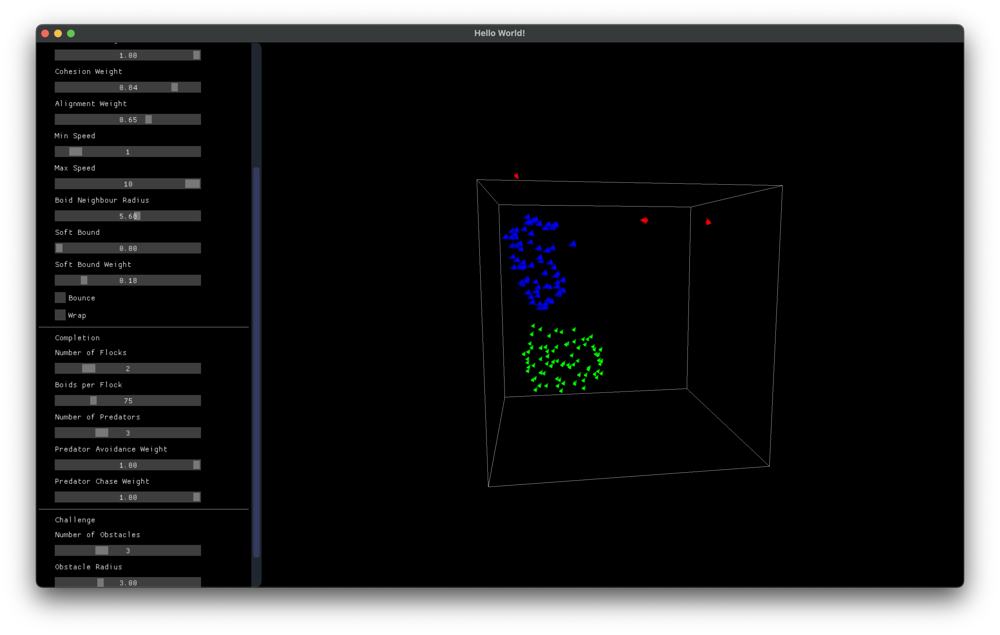
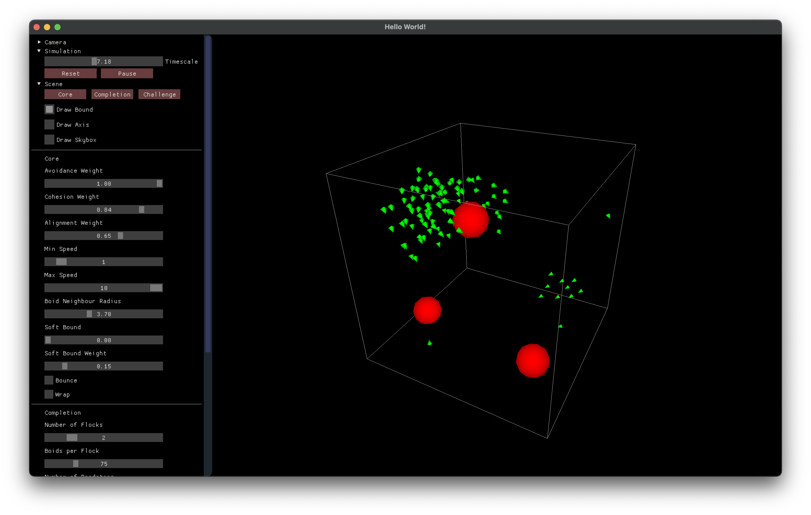

# CGRA354 Assignment 3

- Name: Hamish Burke
- Username: burkehami

## Instructions

1. Build the project:

   ```bash
   mkdir build
   cd build
   cmake ..
   make
   ```

2. Run the application:
   ```bash
   ./bin/a3
   ```

## Sample Images

**Core:**


**Completion:**


**Challenge:**

